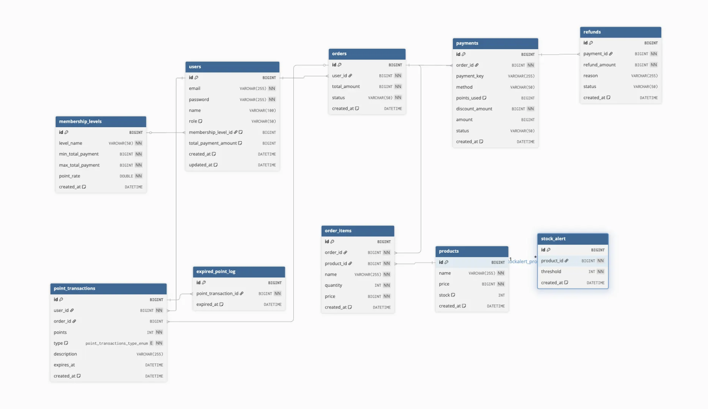
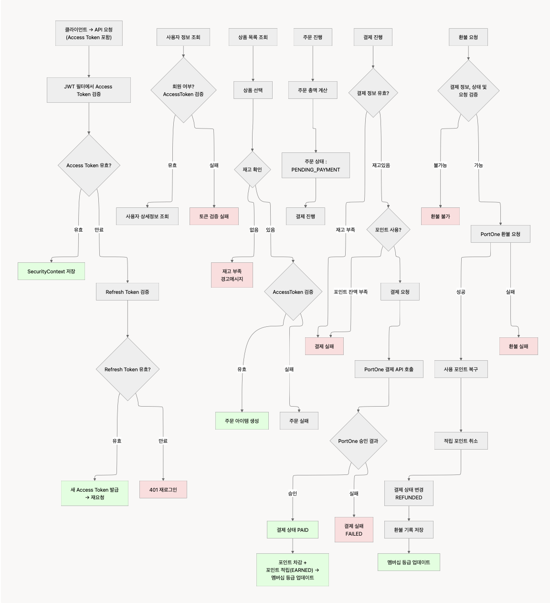

# 📌 결제 시스템 프로젝트

포인트 사용, 멤버십 등급별 혜택, 주문·결제·환불 로직을 포함한 복합 결제 시스템

---
## 🛠 기술 스택

| Category | Stack                             |
|---------|-----------------------------------|
| 💻 Language | Java 17                           |
| ⚙️ Framework | Spring Boot 3.5.6                 |
| 🗄 Database / ORM | MySQL, Spring Data JPA, Hibernate |
| 🔐 Security | Spring Security + JWT             |
| 💳 Payment / External API | PortOne API                       |
| 🏗 Build / Dependency Management | Gradle                            |
| 🧪 API Testing | Postman                           |
|🤖 CI/CD|GitHub Actions + AWS (EC2 / CodeDeploy)|
| 🧠 IDE | IntelliJ IDEA                     |
| 📌 Version Control | Git / GitHub                      |
---
## 📁 프로젝트 구조
<details>
<summary>📂 View Full Folder Tree</summary>

```bash
point-payment/
 ┣ .github/
 ┃ ┗ workflows/             # CI/CD 자동화 설정
 ┃     ┣ ci.yml             # 코드 품질 검사/빌드/테스트 CI
 ┃     ┗ cd.yml             # AWS/서버 배포 CD
 ┣ payment-system/
 ┃ ┣ .gradle/
 ┃ ┣ build/                 # 빌드 산출물
 ┃ ┣ docs/                  # 시스템 문서 매뉴얼
 ┃ ┣ gradle/
 ┃ ┣ scripts/               # 배포 스크립트
 ┃ ┣ src/
 ┃ ┃ ┗ main/
 ┃ ┃   ┣ java/com.sparta.payment_system/
 ┃ ┃   ┃ ┣ client/          # PortOne API 연동 HTTP Client
 ┃ ┃   ┃ ┣ config/          # 외부 API & 애플리케이션 설정
 ┃ ┃   ┃ ┣ controller/      # REST API 진입 레이어
 ┃ ┃   ┃ ┣ dto/             # Request & Response DTO
 ┃ ┃   ┃ ┃ ┣ auth/
 ┃ ┃   ┃ ┃ ┣ order/
 ┃ ┃   ┃ ┃ ┣ payment/
 ┃ ┃   ┃ ┃ ┣ product/
 ┃ ┃   ┃ ┃ ┣ refund/
 ┃ ┃   ┃ ┃ ┗ webhook/
 ┃ ┃   ┃ ┣ entity/          # JPA Entity 정의
 ┃ ┃   ┃ ┣ repository/      # Spring Data JPA Repository
 ┃ ┃   ┃ ┣ security/        # JWT 인증 필터 + 권한 정책
 ┃ ┃   ┃ ┣ service/         # 핵심 도메인 비즈니스 로직
 ┃ ┃   ┃ ┗ PaymentSystemApplication.java
 ┃ ┃   ┗ resources/
 ┃ ┃     ┣ application.yml   # 환경 설정
 ┃ ┃     ┗ static/           # 정적 리소스
 ┃ ┣ .gitignore
 ┃ ┣ build.gradle
 ┃ ┣ Dockerfile              # Docker 빌드 설정
 ┃ ┣ appsec.yml             # AWS CodeDeploy 설정
 ┃ ┗ README.md
 ┣ README.md                # 저장소 메인 문서
 ┣ .gitignore
 ┗ .gitattributes

 ```
</details> 


### 설계 원칙 및 아키텍처 특징
- 📌 **SRP(단일 책임 원칙)** — Controller, Service, Repository, Entity, DTO가 역할별로 분리되어 유지보수 용이
- 📌 **확장 가능한 도메인 구조** — 포인트 → 멤버십 → 정기결제 등 기능 확장을 고려한 도메인 설계
- 📌 **PortOne API 연동 모듈화** — 외부 API 연동은 `client` 계층에서 처리하여 핵심 비즈니스 로직과 분리
- 📌 **DTO 계층 분리** — 요청(Request)/응답(Response) DTO를 엔티티와 분리해 API 안정성과 캡슐화 강화
- 📌 **JWT 기반 인증/인가 구조화** — 인증 필터, 토큰 발급, 인증 정보 매핑이 `security` 패키지로 정리되어 구조적 일관성 확보

---

## ⚙️ 환경설정

### 1️⃣ 전제조건
- JDK 17 이상
- MySQL (로컬 혹은 Docker)
- Gradle 8.x 이상

### 2️⃣ 환경 변수 (.env)
- SPRING_APPLICATION_NAME
- SPRING_DATASOURCE_URL
- SPRING_DATASOURCE_USERNAME
- SPRING_DATASOURCE_PASSWORD
- PORTONE_STORE_ID
- PORTONE_CHANNEL_KEY
- PORTONE_PG_MID
- PORTONE_WEB_SIGNKEY
- PORTONE_INI_API_KEY
- PORTONE_INI_API_IV
- PORTONE_WEBHOOK_SECRET
- JWT_SECRET_KEY

> `.env` 파일은 Git에 커밋되지 않으며, 각자 로컬에서 직접 설정해야 합니다.<br>
> `.gitignore`에 `.env`가 포함되어 있어 커밋되지 않습니다.
---
## 🚀 실행방법

```
# 1. git clone
git clone https://github.com/B-ChJ/point-payment.git

# 2. 환경 변수 설정
.env 예시 파일 생성 후 application.properties 내 변수에 맞춰 설정 필요

# 3. URL 접속 `http://localhost:8080/api/test`
```
---

## ✨ 주요 기능

> 이 프로젝트는 포인트 기반 결제 시스템으로, 인증/주문/결제/환불/포인트 적립/웹훅 기반 자동 상태 관리 기능을 제공합니다.

### 🔐 인증 & 권한

- 회원가입 및 로그인
- Refresh Token 기반 Access Token 재발급
- 로그아웃 시 Refresh Token 블랙리스트 처리

### 🛍 상품 & 주문

- 상품 등록, 조회, 삭제 기능
- 주문 생성 및 주문 정보 조회

### 💳 결제 처리

- 주문 기반 결제 요청 생성
- PortOne 결제 승인 처리
- 결제 내역 조회

### 💸 환불 & 취소

- 사용자가 클라이언트에서 환불 요청
- Webhook 기반 자동 환불 및 취소 처리

### 🪝 Webhook 기반 결제 상태 동기화

- 결제 성공(PAID)
- 결제 실패(FAILED)
- 결제 취소/환불(CANCELLED/REFUNDED)

### 👤 사용자 정보

- 내 정보 조회
- 포인트 잔액 조회
---
## 🧱 ERD 다이어그램

<details>
<summary>📎 ERD 관계 구조 보기</summary>

```
Users (1) ─── (N) Orders
Orders (1) ─── (N) OrderItems
OrderItems (N) ─── (1) Products
Users (1) ─── (N) Payments
Payments (1) ─── (N) Refunds
Users (1) ─── (N) PointTransactions
PointTransactions (N) ─── (1) Orders
Users (1) ─── (1) MembershipLevel
Products (1) ─── (N) StockAlert
```
</details>

---
## 🧭 시스템 처리 흐름 (Flow Chart)



---
## 🔗 API 명세서
👉 전체 엔드포인트 목록 및 응답 스펙은 아래 문서에서 확인할 수 있습니다
- [결제 시스템 API 명세서 링크](https://www.notion.so/teamsparta/2ae2dc3ef51481758651e583fad20fd6?v=2ae2dc3ef5148173b9b8000cba24daaa&source=copy_link)